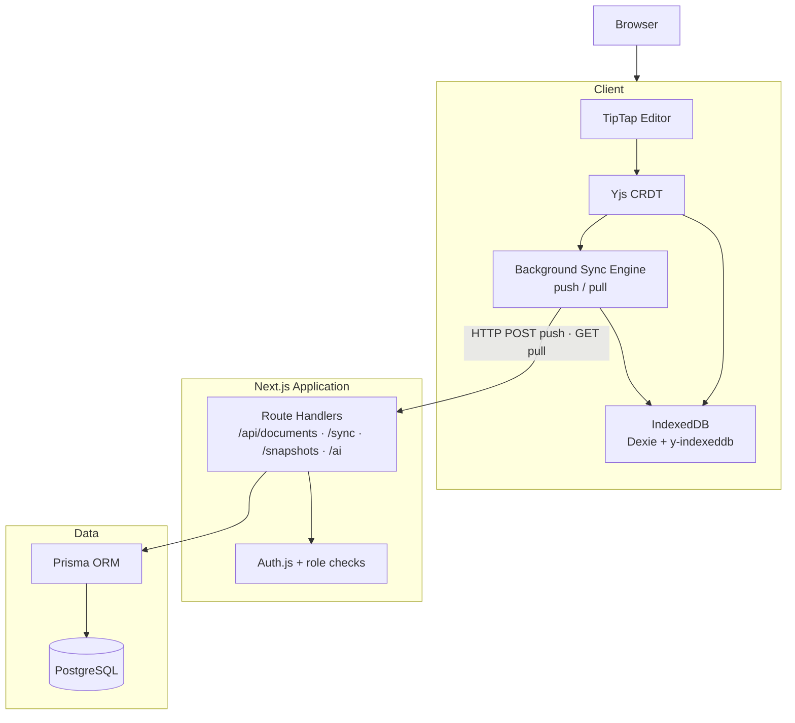
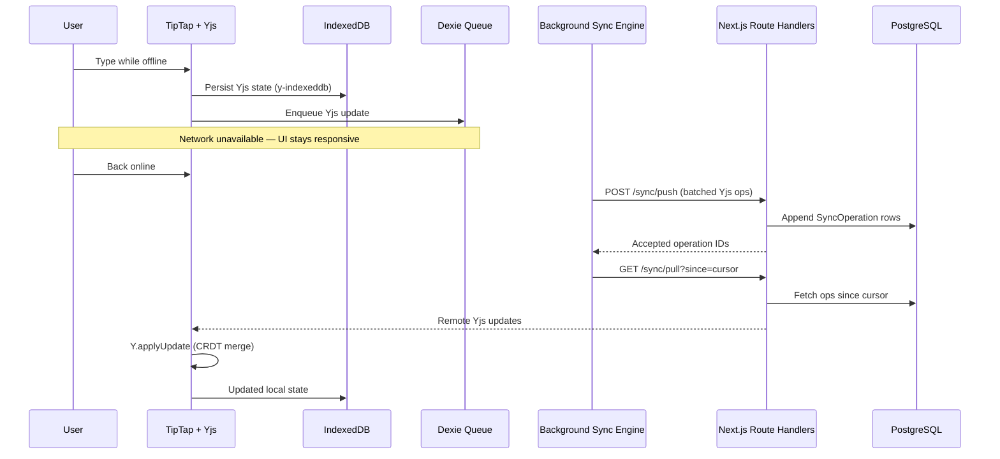

# SyncDocs

**Local-first collaborative document editor** built with Next.js 16, Yjs CRDTs, and PostgreSQL.

SyncDocs lets users create, edit, and share rich-text documents with **zero network dependency for core editing**. Changes are stored locally first, synchronized in the background when connectivity returns, and merged deterministically across devices and collaborators.

| | |
|---|---|
| **Live Demo** | [https://sync-docs-iota.vercel.app/](https://sync-docs-iota.vercel.app/) |
| **Repository** | [https://github.com/himanshu-siddh/syncDocs](https://github.com/himanshu-siddh/syncDocs) |

<!-- Screenshots -->
<!--  -->
<!--  -->
<!--  -->

---

## Project Overview

SyncDocs is a production-oriented application demonstrating **distributed systems concepts in the browser**: local-first storage, offline queues, CRDT conflict resolution, append-only HTTP synchronization, role-based access control, and version history with safe restore.

The server never stores a mutable “latest document body.” Instead, it persists **append-only Yjs update operations** and explicit snapshots. Clients hydrate from IndexedDB, merge remote operations through Yjs, and push local changes through a **debounced HTTP background sync engine** (`POST /sync/push`, `GET /sync/pull`).

**Collaboration model:** Multiple users edit shared documents on their own devices. Each client syncs periodically (automatic debounce or manual “Sync now”). Yjs merges all pushed updates deterministically—there is no WebSocket layer, live presence, or live cursor broadcasting in the current architecture.

This design prioritizes:

- **Resilience** — editing continues when the network fails; offline edits queue locally and flush on reconnect
- **Correctness** — concurrent edits merge via Yjs CRDTs without last-write-wins data loss
- **Security** — authenticated APIs, role checks, and bounded sync payloads
- **Deployability** — **one Next.js application** on Vercel + PostgreSQL on Neon; no second service to operate

For a deeper security write-up, see [SECURITY.md](./SECURITY.md).

---

## Features

| Feature | Description |
|---|---|
| **Local-first architecture** | IndexedDB is the primary store; the UI never blocks on network I/O for edits |
| **Offline editing** | Open, edit, and close documents with no connectivity; supports `local-*` document IDs |
| **Background synchronization** | HTTP push/pull of Yjs updates via Dexie-backed queue, debounced upload (~750 ms), and manual “Sync now” |
| **Multi-user collaboration** | Shared documents converge through periodic sync; Yjs merges concurrent edits deterministically |
| **Version history** | Manual snapshots, timeline view, and restore as a new append-only operation |
| **AI assistant** | Grammar, rewrite, summarize, and title generation via Vercel AI SDK + Google Gemini |
| **Authentication** | Auth.js credentials provider with bcrypt password hashing and JWT sessions |
| **Authorization** | Document roles: **Owner**, **Editor**, **Viewer** — enforced on every API route |

---

## Architecture

### System stack

```text
Browser
   ↓
TipTap + Yjs
   ↓
IndexedDB (Dexie + y-indexeddb)
   ↓
Background Sync Engine
   ↓
Next.js Route Handlers
   ↓
Prisma ORM
   ↓
PostgreSQL
```

### How the layers work together

1. **Browser (TipTap + Yjs)** — Rich-text editing bound to a Yjs CRDT document. Every change produces binary Yjs updates.
2. **IndexedDB** — Client-side persistence in two stores:
   - **Dexie** — document metadata, sync cursors, queued Yjs operations, pending metadata writes/deletes
   - **y-indexeddb** — durable Yjs document state keyed by document ID
3. **Background Sync Engine** (`use-sync-engine`) — Listens for local Yjs updates, enqueues them in Dexie, debounces uploads, **POSTs** batches to `/api/documents/[id]/sync/push`, then **GETs** remote operations from `/sync/pull` and applies them with `Y.applyUpdate`.
4. **Next.js Route Handlers** — Authenticated, validated APIs for documents, sync, snapshots, members, and AI.
5. **Prisma ORM** — Type-safe database access with membership-scoped queries.
6. **PostgreSQL** — Users, `DocumentMember` roles, append-only `SyncOperation` rows, and `DocumentSnapshot` records.

### Architecture diagram



### Offline synchronization workflow

When the network is unavailable, editing continues normally. Updates persist to IndexedDB and accumulate in the Dexie queue. When connectivity returns, the sync engine pushes queued operations and pulls any remote changes.



### Conflict resolution

SyncDocs uses **Yjs CRDTs**, not operational transform or last-write-wins text fields.

- Each edit produces a **binary Yjs update**.
- Updates are **commutative and idempotent** — they can be applied in any order without losing concurrent edits.
- The server stores updates **append-only** with client-generated UUIDs (`skipDuplicates` on push).
- Restore creates a **new** sync operation from snapshot bytes; it does not delete historical operations.

Two users editing the same document—even offline on different devices—converge to the same merged state once both clients push and pull via HTTP sync.

---

## Tech Stack

| Layer | Technology |
|---|---|
| Framework | Next.js 16 (App Router), React 19, TypeScript |
| Styling | Tailwind CSS 4, Radix UI primitives |
| Editor | TipTap 2 + `@tiptap/extension-collaboration` |
| Local storage | Dexie 4, y-indexeddb, Yjs 13 |
| Sync transport | HTTP (Next.js Route Handlers — push/pull) |
| Database | PostgreSQL + Prisma 7 (`@prisma/adapter-pg`) |
| Auth | Auth.js v5 (credentials, JWT sessions) |
| Validation | Zod 4 |
| AI | Vercel AI SDK + Google Gemini |
| Unit tests | Vitest, React Testing Library |
| E2E tests | Playwright |
| CI | GitHub Actions |

---

## Folder Structure

```text
local-first-collab-editor/
├── .github/workflows/ci.yml   # Lint, typecheck, test, build, e2e
├── e2e/                       # Playwright specs + helpers
│   ├── helpers/               # auth, editor, db, sync-api utilities
│   ├── offline-sync.spec.ts
│   ├── concurrent-editing.spec.ts
│   ├── viewer-permissions.spec.ts
│   └── version-history.spec.ts
├── prisma/
│   ├── schema.prisma          # Users, members, operations, snapshots
│   └── migrations/
├── public/                    # Static assets (app icon)
├── src/
│   ├── app/                   # App Router pages + API routes
│   │   ├── api/documents/     # CRUD, sync push/pull, snapshots, members
│   │   ├── api/ai/            # AI assistant endpoint
│   │   └── documents/         # Document workspace UI
│   ├── actions/               # Server actions (auth, documents)
│   ├── components/            # UI shell, sidebar, editor panels
│   ├── editor/                # TipTap rich-text editor
│   ├── hooks/                 # Yjs doc, sync engine, online status
│   ├── sync/                  # Dexie schema, encoding, metadata sync
│   ├── server/                # Auth helpers, HTTP utilities
│   ├── validation/            # Zod schemas + payload limits
│   ├── auth.ts                # Auth.js configuration
│   └── proxy.ts               # Session gate (Auth.js)
├── SECURITY.md                # Security architecture documentation
├── playwright.config.ts
├── vitest.config.ts
└── .env.example
```

---

## Environment Variables

Copy `.env.example` to `.env` and fill in values:

| Variable | Required | Description |
|---|---|---|
| `DATABASE_URL` | Yes | PostgreSQL connection string (e.g. [Neon](https://neon.tech)) |
| `AUTH_SECRET` | Yes | Random secret for JWT/session signing (`openssl rand -base64 32`) |
| `NEXT_PUBLIC_APP_URL` | Yes | Public app URL (`http://localhost:3000` in dev) |
| `GEMINI_API_KEY` | For AI | Google AI API key for the AI assistant panel |
| `GEMINI_MODEL` | No | Gemini model name (default: `gemini-2.5-flash`) |

No WebSocket or Socket.IO environment variables are required.

---

## Local Setup

### Prerequisites

- Node.js 20+
- PostgreSQL (local Docker, [Neon](https://neon.tech), or similar)

### Steps

```bash
# 1. Clone and install
git clone https://github.com/himanshu-siddh/syncDocs.git
cd local-first-collab-editor
npm install

# 2. Configure environment
cp .env.example .env
# Edit .env with your DATABASE_URL and AUTH_SECRET

# 3. Run migrations
npm run prisma:migrate

# 4. Start the dev server (single process — no separate sync service)
npm run dev
```

Open [http://localhost:3000](http://localhost:3000), register an account, and create a document.

### Test offline behavior

1. Open a document in the editor.
2. Toggle **Offline** in DevTools → Network.
3. Edit the document — the status bar shows `offline`.
4. Go back online and click **Sync now** (or wait for automatic debounced sync).

---

## Testing

### Unit tests

```bash
npm test
```

Covers Zod validation, auth form rendering, and Yjs merge determinism.

### Integration tests (requires `DATABASE_URL`)

```bash
npm run test:integration
```

Exercises append-only sync storage, Yjs merge from PostgreSQL operations, and snapshot restore semantics.

### End-to-end tests (Playwright)

Install browsers once:

```bash
npm run test:e2e:install
```

Run the suite:

```bash
npm run test:e2e
```

E2E coverage includes:

- Offline edit → reconnect → HTTP sync persistence
- Two-user merge via push/pull without data loss
- Viewer write denial (UI + API 403)
- Version restore as append-only history

### Full verification (matches CI)

```bash
npm run lint
npm run typecheck
npm test
npm run build
npm run test:integration
npm run test:e2e
```

---

## Deployment Guide

SyncDocs deploys as a **single Next.js application**. All synchronization runs over HTTP through Next.js Route Handlers—**no separate WebSocket or Socket.IO service is required**.

### Recommended stack

| Component | Platform |
|---|---|
| Next.js app | [Vercel](https://vercel.com) |
| PostgreSQL | [Neon](https://neon.tech) (recommended) |
| CI | GitHub Actions (included) |

### Steps

1. **Create a Neon project** and copy the PostgreSQL connection string into `DATABASE_URL`.
2. **Import the repository** into Vercel and set environment variables:
   - `DATABASE_URL` — Neon connection string (`sslmode=verify-full` recommended)
   - `AUTH_SECRET` — random 32+ byte secret
   - `NEXT_PUBLIC_APP_URL` — your production Vercel URL
   - `GEMINI_API_KEY` — optional, for AI features
   - `GEMINI_MODEL` — optional (default: `gemini-2.5-flash`)
3. **Run migrations** against the production database:

   ```bash
   npx prisma migrate deploy
   ```

4. **Deploy** from the connected Git branch. Vercel builds and serves the app; sync endpoints are included in the same deployment.
5. **Verify** registration, document create, offline edit, push/pull sync, and role enforcement in production.

### CI/CD

GitHub Actions (`.github/workflows/ci.yml`) runs on push/PR to `main`/`master`:

- **verify** — install, lint, typecheck, unit tests, build
- **e2e** — Postgres service, integration tests, Playwright sync suite

---

## Security Summary

| Area | Approach |
|---|---|
| Authentication | Auth.js credentials + bcrypt (cost 12) + JWT sessions |
| Authorization | `DocumentMember` role checks on every document API route |
| Payload validation | Zod schemas for all request bodies and query params |
| OOM prevention | 256 KiB max Yjs update, 2 MiB max snapshot, 100 ops/push, 500 ops/pull |
| Tenant isolation | Application-level ORM scoping via membership (see SECURITY.md for RLS roadmap) |
| Viewer enforcement | UI disables editing; API returns 403 on sync push |
| Sync transport | HTTPS-only HTTP push/pull; no open WebSocket attack surface |

Full details: [SECURITY.md](./SECURITY.md)

---

## Future Improvements

The current architecture **intentionally uses HTTP background synchronization** to simplify deployment and preserve offline-first behavior. Possible enhancements:

- **WebSockets / Socket.IO (optional)** — instant live collaboration, presence indicators, and live cursors; would require a separate long-lived service or managed realtime provider alongside the Vercel app
- **PostgreSQL Row Level Security (RLS)** — database-enforced tenant isolation
- **Rate limiting** — edge or middleware limits on auth, sync, and AI routes
- **Operation compaction** — snapshot + prune old `SyncOperation` rows for long-lived documents
- **OAuth providers** — Google/GitHub sign-in alongside credentials
- **Encrypted local storage** — optional at-rest encryption for sensitive deployments
- **Screenshots** — add editor, offline sync, and version history captures for portfolio presentation

---

## License

Private / assignment project. Update this section if you open-source the repository.

---

## Author

**[himanshu-siddh](https://github.com/himanshu-siddh)** — [LinkedIn](https://www.linkedin.com/in/himanshu-siddh-98aaa0416)

Built as a full-stack assignment demonstrating local-first architecture, CRDT sync over HTTP, and production engineering practices.
